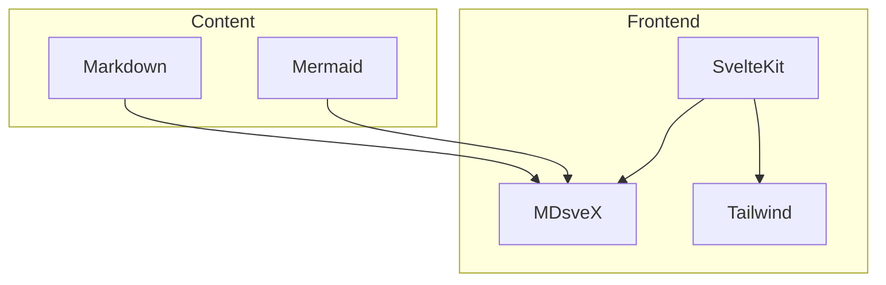
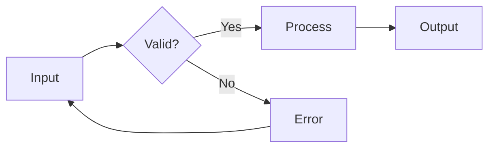
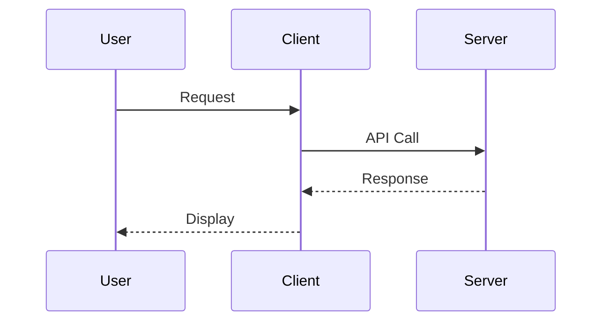

# Mermaid Diagram Style Guidelines

This document defines the styling standards for Mermaid diagrams across the wcygan.github.io application to ensure visual consistency and maintainability.

## Design Principles

1. **Dark Theme First**: All diagrams use a dark theme consistent with the site's zinc-based color palette
2. **Emerald Accents**: Primary accent color is emerald-400 (#34d399) for emphasis and interactivity
3. **High Contrast**: Ensure readability with appropriate contrast ratios
4. **Consistent Typography**: Use Inter font family throughout all diagrams
5. **Responsive Design**: Diagrams must scale appropriately on all devices
6. **Mobile Optimization**: Enhanced touch interactions and readable text on small screens

## Color Palette

### Base Colors

- **Background**: `zinc-900` (#18181b) - Container background
- **Surface**: `zinc-700` (#3f3f46) - Node fills
- **Border**: `zinc-600` (#52525b) - Subtle borders
- **Text**: `zinc-100` (#e4e4e7) - Primary text
- **Muted Text**: `zinc-400` (#a1a1aa) - Secondary text

### Accent Colors

- **Primary**: `emerald-400` (#34d399) - Node borders, emphasis
- **Primary Dark**: `emerald-500` (#10b981) - Hover states
- **Secondary**: `zinc-500` (#71717a) - Edges, lines

## Component-Specific Styles

### Container Styling

```css
.mermaid-container {
  margin: 1.5rem 0;
  padding: 1rem;
  background: zinc-900;
  border-radius: 0.5rem;
  overflow-x: auto;
  min-height: [height]px;
}
```

### Flow Charts

```css
/* Nodes */
- Fill: zinc-700 (NEVER use emerald as fill)
- Stroke: emerald-400
- Stroke Width: 2px (3px for emphasis)
- Text: zinc-100

/* Edges */
- Stroke: zinc-500
- Stroke Width: 2px
- Arrowheads: zinc-500

/* Subgraphs */
- Fill: zinc-800
- Stroke: zinc-600
- Label: zinc-400

/* Emphasis */
- Use stroke-width: 3px instead of changing fill color
- External/system nodes can use fill: zinc-600
```

### Sequence Diagrams

```css
/* Actors */
- Fill: zinc-700
- Stroke: emerald-400
- Text: zinc-100

/* Lifelines */
- Stroke: zinc-600
- Stroke Width: 1px

/* Messages */
- Stroke: zinc-500
- Text: zinc-100
- Background: zinc-900 (for labels)
```

### State Diagrams

```css
/* States */
- Fill: zinc-700
- Stroke: emerald-400
- Text: zinc-100

/* Transitions */
- Stroke: zinc-500
- Arrowheads: zinc-500
```

### Git Graphs

```css
/* Commits */
- Fill: emerald-400
- Stroke: emerald-500
- Size: 10px

/* Branches */
- Stroke: Various (auto-assigned)
- Stroke Width: 2px
```

### Entity Relationship Diagrams

```css
/* Entities */
- Fill: zinc-700
- Stroke: emerald-400
- Text: zinc-100

/* Relationships */
- Stroke: zinc-500
- Text: zinc-400
```

### Pie Charts

```css
/* Segments */
- Use emerald/zinc gradient
- Stroke: zinc-800
- Labels: zinc-100
```

## Implementation Guidelines

### 1. Component Usage

```svelte
<MermaidDiagram
  height={400}
  diagram={`graph TD
    A[Start] --> B{Decision}
    B -->|Yes| C[Process]
    B -->|No| D[End]`}
/>
```

### 2. Height Recommendations

- Simple flow charts: 300-400px
- Sequence diagrams: 400-600px
- Complex diagrams: 500-800px
- Allow content to determine final height

### 3. Diagram Content Guidelines

- Keep node labels concise (2-4 words)
- Use meaningful IDs for clickable elements
- Include descriptive edge labels where helpful
- Limit subgraph nesting to 2 levels

### 4. Accessibility

- All diagrams must have `role="img"`
- Include descriptive `aria-label`
- Provide text alternatives for complex diagrams
- Ensure color contrast meets WCAG AA standards

### 5. Performance

- Leverage caching via `mermaid-cache` utility
- Use viewport-based loading for below-fold diagrams
- Keep diagram complexity reasonable
- Batch multiple small diagrams when possible

## Mobile Responsive Design

### Mobile-First Approach

The application implements comprehensive mobile optimizations for Mermaid diagrams:

#### 1. Responsive Breakpoints

- **Tablet (≤768px)**: Adjusted padding, font sizes, scroll indicators
- **Mobile (≤480px)**: Further optimized font sizes, compact spacing
- **Touch devices**: Enhanced touch targets and smooth scrolling

#### 2. Mobile-Specific Features

##### Horizontal Scroll Indicators

- Automatic detection of scrollable content
- Visual "← Scroll →" indicator with pulsing animation
- Fade-out edge effect for better UX

##### Fullscreen Viewing

- Dedicated fullscreen button on mobile devices
- Modal overlay with optimized SVG scaling
- Touch-friendly close button

##### Optimized SVG Rendering

- Dynamic viewBox calculation with padding
- `preserveAspectRatio="xMidYMid meet"` for proper scaling
- Automatic width adjustment for mobile viewports

#### 3. Mobile CSS Classes

```css
/* Scrollable container detection */
.mermaid-container[data-scrollable="true"] {
  overflow-x: auto;
  -webkit-overflow-scrolling: touch;
}

/* Mobile font sizing */
@media (max-width: 768px) {
  .mermaid-render-container text {
    font-size: 12px !important;
  }
}

/* Touch-friendly targets */
@media (pointer: coarse) {
  .mermaid-render-container .node {
    cursor: pointer;
  }
}
```

#### 4. Performance Optimizations

- Viewport-based lazy loading with reduced margins on mobile
- SessionStorage caching persists across page views
- Resize event handling for orientation changes

### Mobile Testing Guidelines

1. **Test on real devices** when possible
2. **Check both portrait and landscape** orientations
3. **Verify touch interactions** work smoothly
4. **Ensure text remains readable** at all zoom levels
5. **Test scroll performance** on long diagrams

## CSS Override Patterns

### Global Overrides (app.css)

```css
/* Override Mermaid's inline styles */
.mermaid-render-container .node rect {
  fill: rgb(63, 63, 70) !important; /* zinc-700 */
  stroke: rgb(52, 211, 153) !important; /* emerald-400 */
}

/* Ensure text visibility */
.mermaid-render-container text {
  fill: rgb(228, 228, 231) !important; /* zinc-100 */
  font-family: 'Inter', system-ui, sans-serif !important;
}
```

### Component-Level Styling

```css
/* Container responsive behavior */
.mermaid-container {
  @apply relative overflow-x-auto rounded-lg bg-zinc-900 p-4;
}

/* SVG responsive sizing */
:global(.mermaid-render-container svg) {
  max-width: 100%;
  height: auto;
  display: block;
  margin: 0 auto;
}
```

## Diagram Type Examples

### 1. Architecture Diagram



### 2. Process Flow



### 3. Sequence Interaction



## Mermaid Configuration

### Initialize Settings

```javascript
mermaid.initialize({
  startOnLoad: false,
  theme: 'dark',
  securityLevel: 'loose',
  logLevel: 'debug',
  flowchart: {
    useMaxWidth: true,
    htmlLabels: true,
    curve: 'basis'
  }
});
```

### Theme Variables

Ensure these are set in the Mermaid initialization:

- `darkMode: true`
- `background: transparent`
- `primaryColor: #34d399`
- `primaryTextColor: #e4e4e7`
- `primaryBorderColor: #34d399`
- `lineColor: #71717a`

## Troubleshooting

### Common Issues

1. **Text not visible**: Check fill color overrides
2. **Overflow on mobile**: Ensure container has `overflow-x-auto`
3. **Blurry rendering**: SVG might need explicit dimensions
4. **Style conflicts**: Use `!important` in global overrides

### Debug Mode

Enable debug logging in component:

```javascript
logLevel: 'debug' // in mermaid.initialize
console.log('[MermaidDiagram]', status); // Component status
```

## Best Practices

1. **Consistency**: Use the same diagram style for similar content types
2. **Simplicity**: Prefer clarity over complexity
3. **Responsive**: Test on mobile devices
4. **Performance**: Cache rendered diagrams
5. **Accessibility**: Always provide context
6. **Documentation**: Comment complex diagram logic

## Future Enhancements

- [ ] Light theme support
- [ ] Custom color themes per diagram type
- [ ] Animation support for transitions
- [ ] Export functionality
- [ ] Interactive clickable elements
- [ ] Enhanced mobile gestures
